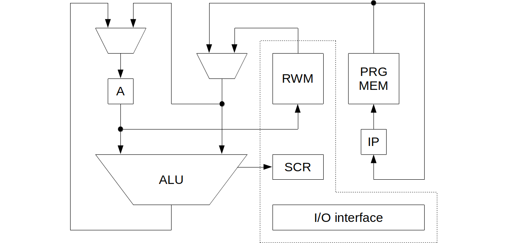

# Six Alpha

> Accumulator-based 4-bit processor.

Six Alpha is a 4-bit accumulator-based processor architecture implemented as a softcore processor described in VHDL. It is based on my very first processor I have created in VHDL, which was tested on an Altera FPGA board. Later, it was ported to Digilent Basys 2 board.

The next traits include:

* Harvard memory architecture
* May address up to 128 B of instructions
* May address up to 16 nibbles of data
* I/O ports in data memory address space

## Machine Code

If you are curious what the machine code of Six Alpha looks like, browse the [collection of such programs](sw).

## Useful Resources

* [support.md](support.md) – questions, answers, help
* [contributing.md](contributing.md) – how to get involve
* [license](license) – author and license
